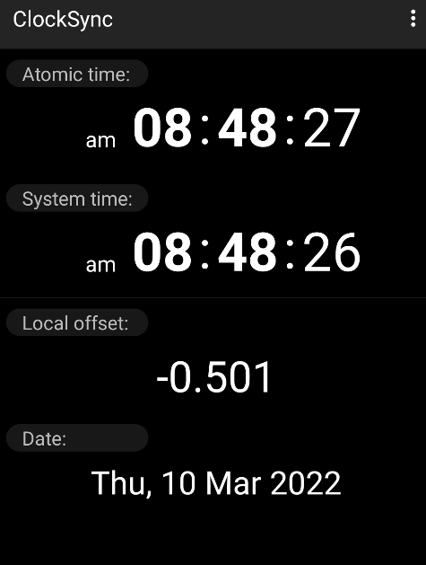
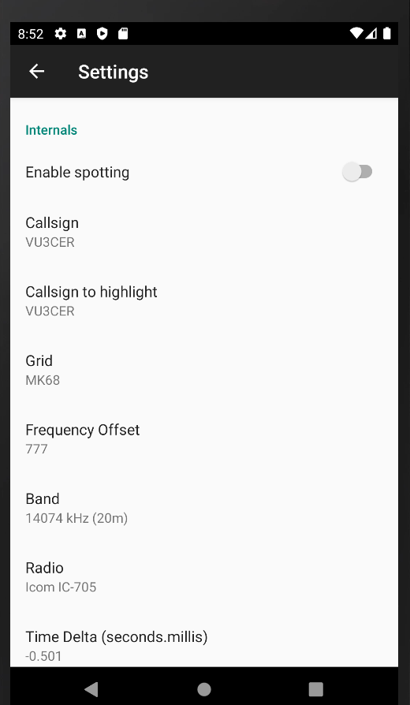
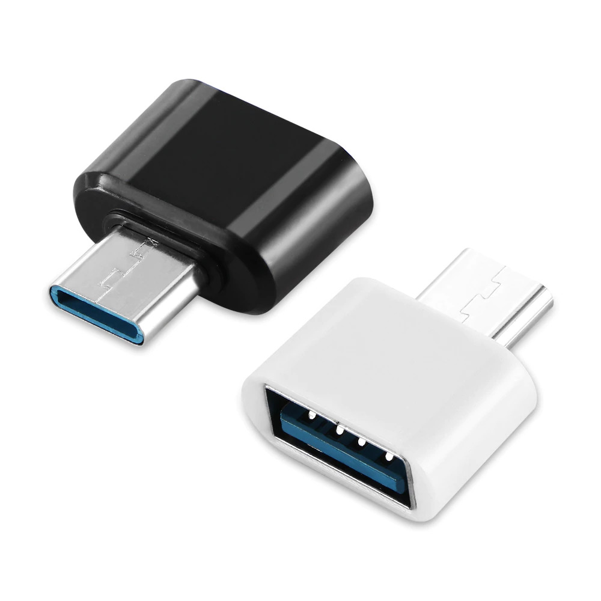
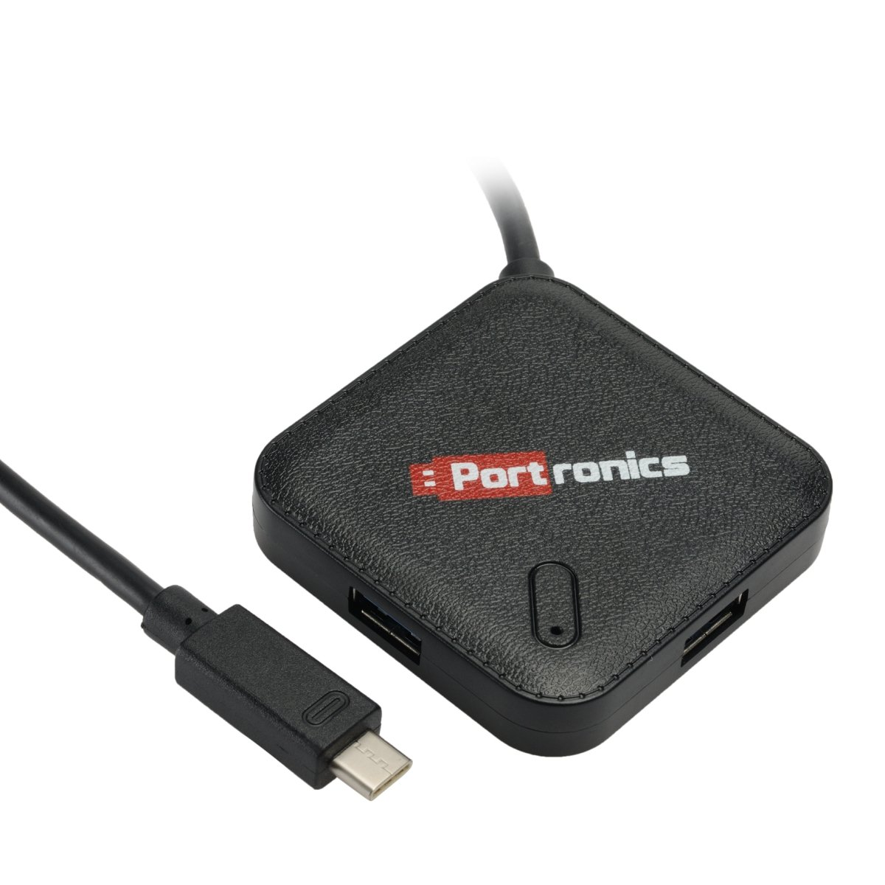

#### Help File

The `FT8 Radio` app allows operating FT8 on your radio in a portable
(field/remote locations) fashion using an Android phone.

Note: It is meant for remote, digital SOTA / POTA activations. It 'sucks' for
indoors use - use WSJT-X at home instead ;)

Note 2: I recommend getting familiar with FT8 QSOs with WSJT-X on a PC (or RPi)
first. The app is like a simpler (and poorer version) of WSJT-X. If you are not
familiar with WSJT-X, and rig interfacing, you are likely to have a tough time
with this app. See https://github.com/kholia/DigitalRadioReceiverSupport#new-to-ft8
for some help on this topic.

The app handles FT8 RX, TX, QSO logging, and CAT control all by itself. No PC
or Raspberry Pi is required!

Note 3: The app uses an optimized message sequencing to have quick, legit QSOs.

#### Instructions

- Ensure that the Android phone has the correct time on it. This is critical to get right.

  To correct the time on your phone WITHOUT root access, copy the `Local offset`
  value from the [ClockSync app](https://m.apkpure.com/clocksync/ru.org.amip.ClockSync)
  into the `Time Delta` field in the app settings (keeping the negative sign as
  it is, if present).

  Example:

  The `ClockSync` app shows `-0.501` as the `Local offset`.

  

  So enter the same exact `-0.501` value in the `Time Delta` field in the app
  settings.

  

  Update 1: The app now supports getting the time from the phone's GPS
  subsystem. This feature is only activated when the user clicks the `GPS
  button` manually.

  To test and debug the GPS functionality on your phone, please use [the `GPSTest` app](https://github.com/barbeau/gpstest).

  Update 2: You may use the https://time.is/ website on your phone instead of
  ClockSync to get the `Time Delta` value.

- Disconnect the rig from the phone.

- Launch the `FT8 Radio` app.

- In `App -> Settings`, select your rig model.

  General example: When using AF (VOX) mode with IC-7300, select `VOX` as the
  radio model in the app settings. When using CAT mode with IC-7300, select
  `IC-7300` as the radio model.

  Set your callsign, grid, and band as well.

  ATTENTION: The callsign, and grid values need to be in UPPERCASE (CAPITAL LETTERS).

  Example: VU3CER (callsign) and MK68 (grid).

- Configure the rig for FT8.

  For IC-705 / IC-7300, select the `FT8 mode preset`. This is explained on [this page](https://www.icomjapan.com/news/3208/).

- Connect the rig to the phone.

  For IC-705, connect the rig to the phone via a Micro-USB cable + an OTG-adapter.

- Note: Kill the app (yes please...).

- Start the app manually again.

- IMPORTANT: Once you are in the app, increase the volume to the maximum. This
  is required for getting the correct audio drive (AF drive) for the radio.

- You are good to go. All the best, and good DX!

- You can check (debug) your FT8 transmissions on the https://pskreporter.info/
  site. Doing so is highly recommended!

  If you can't see your signal on this site, please double-check the time on
  your phone, and also double-check the volume on the phone for the app.

  I also use the IC-705's inbuilt monitor to see that the radio is consuming
  appropriate (and large) amount of current when TX'ing.

  You may find http://beta.reversebeacon.net/main.php useful too.

- Note: The application doesn't run any (background) services. It can be
  exited from or killed like any other regular Android app.

- TIP: If you do NOT use USB for CAT control, you can choose the `VOX` or
  `Unknown` radio model in app settings to avoid annoying pop-up messages.

#### Usage

Thanks for taking the time to set up the app.

The `App Settings -> PTT ON (Test CAT)` button can be used to quickly check
that CAT control is working (or not).

The app will automatically start decoding FT8 messages, and the newest
messages are on the top (of the screen).

To respond to a particular callsign, just click on that callsign. The app
will automatically determine the correct message to send. The app will also
turn on the `TX` button to say `TX ON`. The actual FT8 TX will happen at
the next appropriate FT8 timing window.

The app has a smart `state machine` feature (auto-sequencing feature) built
into it. This means that once the QSO process has been started, the app will
automatically try to finish the QSO without requiring further manual human
action.

Note: The TX LED on the radio will automatically turn RED when the transmission
is taking place.

If you would like to cancel an upcoming transmission, just press the `TX ON`
button once - this button will now say `TX OFF` and the upcoming transmission
will be canceled. If the `TX` button says `TX OFF` already, then no
transmission event is upcoming.

If you would like to send a particular FT8 message manually, then select the
FT8 message from the dropdown list of predefined messages, and then turn on the
`TX` button by pressing it - a turned on `TX` button says `TX ON`.

The `RST` (RESET) button enables own CQ-calling when the `TX ON` appears.

#### What's New? (July 2022)

- Initial CAT PTT support for IC-9700
- Experimental CAT PTT support for ADX TS-480
- Basic and buggy odd-even cycle support is here!
- 'Dark Mode' is here (see documentation)
- Initial support for SOTAmat
- Xiegu X6100 radio is fully supported now
- Experimental CAT PTT support for Lab599 Discovery TX-500 radio

#### Known Bugs / Issues / "Features"

- The app doesn't handle screen rotations well - so please disable screen
  rotation on your phone.

- This app only allows responding to the latest decoded FT8 messages. You can't
  respond to old messages (yet).

  The app is unable to enable `callsign highlighting` for older decoded
  messages.

- The app doesn't show the FT8 messages being transmitted by the user (on most
  rigs)..

- ATTENTION: After changing the app settings, a manual app restart may be
  needed.

- The usability is NOT great, primarily because of strict FT8 timing
  requirements and the ergonomics involved with small touch screens.

- The app currently ONLY supports the following radios:

  - Generic radio support using VOX
  - Icom IC-705 - Uses Micro-USB cable with OTG adapter - use baud rate 9600
  - Icom IC-7300 - Uses USB cable with OTG adapter - use baud rate 4800
  - uBITX (various versions) - Needs a suitable digital interface (like LiDi v2)
  - Xiegu G90 - USB audio interface wired directly to the ACC port on the radio
  - Xiegu G1M - Works with an USB interface
  - Xiegu X6100 - Works fine in CAT mode and also in VOX mode (keep`Port Number` 1 in App Settings)
  - (tr)uSDX - Simple homebrew audio cable works great in VOX mode
  - Yaesu FT-857D - Works fine with DigiRig interface (from K6ARK)
  - Yaesu FT-991A - Tested with Galaxy Tab A 2016 by David (F4DVX)
  - Kenwood TS-590S - Currently untested
  - Yaesu FT-817 / FT-818 -  SignaLink USB connected via OTG cable + using the DATA socket on radio
  - Yaesu FT-897 - Currently untested
  - QDX - CAT PTT support tested by HB9TXB, CAT Band Switching tested by ND7Y (Tyler)
  - Lab599 Discovery TX-500 - Experimental CAT support untested by us so far
  - Elecraft KX3 - Tested with DigiLink Nano interface (www.hb9zhk.ch) + a
    Lenovo tablet (M10 FHD Plus 2nd Gen. LTE)
  - ADX (LU7DID firmware emulating TS-480 @ 19200 bps) - Basic CAT PTT support works
  - Icom IC-703 - works fine in VOX mode with `ZLP Electronics MiniProSC` interface

  Please reach out to us to get support for more radios.

- CAT control support for some radios is incomplete - only the PTT
  functionality is implemented. This is because we don't have access to these
  radios ourselves for development and testing purposes.

  NOTE: Please reach out to us to get better CAT support for such radios.

- The `signal strength` values shown (and used) by the app are different
  from the WSJT-X SNR values.

- The seconds-timer is a bit wobbly. Please excuse it.

- On Android, we can't easily use the 3.5mm audio jack (TRRS) for audio input.

  So rigs without inbuilt sounds cards will need a digital interface / USB
  sound card for audio reception.

  Reference: https://www.epanorama.net/blog/2014/09/15/android-device-external-mic-wiring/

  Update: To use the 3.5mm audio jack on the phone, see the following project:

  Note: https://github.com/4x1md/phone_rtty_interface - use this open-source
  project.

- It can be difficult to reply back when multiple responses ("calls") are
  received at once.

  Tip: Let the app handle the pileup (multiple responses) on its own.

#### Debugging Tips

- Increase the volume after launching the app.

- Make sure that your `Callsign` value is in UPPERCASE in App Settings.

  Example: `VU3CER` is correct but `vu3cer` isn't!

- Make sure that your `Grid` value is in UPPERCASE in App Settings.

  Example: `ML76` is correct but `ml76` isn't!

#### Safety Tips

Use a common mode choke (CMC) near the rig.

https://github.com/kholia/HF-Balcony-Antenna-System has some details on this topic.

#### Antenna Recommendations

- https://k6ark.com/ antennas cannot be beaten when it comes to portability - try them out!

- https://github.com/kholia/HF-Balcony-Antenna-System

#### FAQ

1. What does the `31 +0.32 1753 ~ CQ AP2IN MM63` line actually mean?

   - The first column (31) is the relative `signal strength` - a higher number
     means a stronger signal.

   - The second column (+0.32) is the `DT` value (time delay), which is similar to
     WSJT-X.

   - The third column (1753) is the frequency offset.

   - After the `~` character we have the FT8 message, which is `CQ AP2IN MM63` in
     this case.

2. I see a green microphone icon appear near the battery amount in the upper
   right corner of the screen. Is this OK?

   Yep - this is the expected behavior.

3. RX and TX are working fine. Now, how do I have a QSO!?

   Click on a callsign from the latest decoded FT8 messages. The app will turn
   on the TX mode, and send an appropriate message at the correct time.

   After this initial action, the rest of the QSO process is automatically
   handled by the app, just like WSJT-X.

   I recommend getting familiar with FT8 QSOs with WSJT-X on a PC (or RPi)
   first. The app is like a simpler (and poorer version) of WSJT-X.

4. What kind of a sound card do I need?

   Modern rigs (e.g. IC-705, IC-7300) have in-built sound cards, and with such
   rigs a separate sound card is NOT needed.

   E.g. For IC-705, I use an old phone charging Micro USB cable along with a small
   USB-C OTG adapter.

   

   If your rig doesn't have an in-built sound card, you can buy a cheap (1 to 2
   USD) USB sound card.

   https://github.com/kholia/DigitalRadioReceiverSupport URL has a picture
   of a suitable sound card. These are available easily on AliExpress and
   Amazon.

   This sound card is connected to the following `USB OTG Hub (Type-C)`.

   

   The USB Hub is required as we need to connect two things (the CAT cable and
   the sound card) to a single USB port of the phone.

5. How do I upload the QSO logs to QRZ.com or LoTW?

   In the app, click on the `Share` icon. This will allow you to export the QSO
   logs in a file named `qso_logs.adi`.

   This ADIF file can then be uploaded to LoTW or QRZ.com as usual.

6. What does the `SPX` (SIMPLEX) button do in the app?

   `SPX OFF` means that the app will work in `split mode` where the RX and TX
   frequencies are different.

   And so on.

7. What does the `CLS` button do in the app?

   The `CLS` button clears the app's display. Just like the DOS command ;)

8. How do I call with `CQ SOTA <callsign> <grid>` or `CQ POTA <callsign>
   <grid>` message?

   Please select the appropriate pre-prepared SOTA/POTA message from the
   'message dropdown list' in the app, and then click on the `TX OFF` button
   once.

   The app will then send the SOTA/POTA message in the upcoming FT8 TX cycle.

9. How do I request support for a particular radio model (rig)?

   Once you have connected the rig to the Android phone using a suitable cable
   or digital interface, please run the [USB Device Info](https://play.google.com/store/apps/details?id=aws.apps.usbDeviceEnumerator)
   app on your phone, and share the app screenshots with us.

   Essentially, we are looking for the USB-serial port details (Speed, VID,
   PID, CDC or not).

10. How do I use the `GPS Time Synchronization` feature of the app?

    - Click on the `location` icon in the app. Give approval for the `Location
      Permissions` needed by the app.

    - Click again on the `location` icon again.

    - Let the app sit here for a while. Wait for the `Time Delta` value to
      stabilize well. I usually give it around a minute or more to settle down.

    - Click on the `STOP CONTINUOUS SYNC` button and press the back button on
      the phone.

    - You are done ;)

11. How do I activate the `Dark Mode` in the app?

    `Dark Mode` is automatically activated depending on your phone settings.

    On your phone, please enable the `Settings -> Display -> Dark theme` option,
    and relaunch the app.

12. What does the `Enable Spotting` option do? What is `spotting`?

    The `spotting` feature uploads your FT8 decodes to the https://pskreporter.info/ site.

    This is an optional feature.

#### Radio Setup Instructions

1. How do I configure `Xiegu X6100` in CAT mode?

   - Select `Xiegu X6100` as the `Radio` in App Settings.

   - Set `Port Number` value to `1`.

   - Restart the FT8 app by force killing it first, and then relaunching it.

   - You are done ;)

2. How do I configure `Elecraft KX3` in CAT mode?

   - Use the original KXUSB cable from Elecraft.

   - Select the `TS-590S (38400)` model in the `Radio` field in the App Settings.

   - Restart the FT8 app by force killing it first, and then relaunching it.

   - You are done ;)

3. How do I configure `IC-706` (or IC-706MKIIG) to work with the app?

   Set the radio model to `VOX` or `Unknown` in the App Settings.

   Use one of the following digital interfaces:

   - SignaLink USB Interface

   - RIGblaster Advantage

   - DigiMaster MiniProSC (https://www.g4zlp.co.uk/unified/DM_MiniPro_SC.shtml)

   Note: [IC-706 does NOT support PTT functionality via CAT control](https://github.com/Hamlib/Hamlib/blob/ea9257db45231d8fef6a64b7e7086f63b996af2a/rigs/icom/ic706.c#L158).

#### Phone (Device) Gotchas

The Samsung Galaxy S22 Ultra phone doesn't seem to emit audio properly to drive
the connected IC-705 radio. To fix this problem, give the following steps a
try:

- Go to Settings > Device Care > Battery > Charging. Set `Fast charging` to
  OFF.

- Enable `Developer Options` on your phone. Google search to find the steps
  involved.

- Ensure that the `Disable USB audio routing` is OFF in `Developer Options`.

- Granting storage permissions to the `Samsung USB-C Headset` app can also
  help in some cases.

- Restart the app (this may perhaps be required?).

- Google for `samsung usb-c no audio` - this results in many hits!

- Note: If the phone is emitting audio correctly, the IC-705 will consume over
  2A current when TX'ing at 10W level!

- Alternate solution: Buy a mid-segment Xiaomi phone (e.g. Redmi Note 11 Pro).
  They just work without problems.

Samsung S7: In CAT mode, Audio TX works but audio RX only works sporadically
with IC-7300. We suspect that Android is using a low volume for the USB audio
input device on S7 phone. For now, we recommend using the `VOX` mode (AF mode)
when using Samsung S7 phone (and similar phones) along with a VOX based digital
interface.

Samsung Galaxy models running Android 9 may be problematic as they can't find
connected USB devices like Arduino Nano (using FT232 chip). In contrast, newer
Galaxy phones - like Galaxy A52 running Android 11 - work just fine.

Recommended phones: Any of the low-range / mid-range Xiaomi phones with 3.5mm
jack should be OK.

#### Tested Phones + Tablets

- Redmi Note 7

- Redmi Note 7 Pro

- Redmi Note 8 Pro - 1080 x 2340 pixels

- Redmi Note 8 Pro Max

- Google Pixel 4 (Android 12) - comes without 3.5mm audio jack

- OnePlus Nord N10 - has 3.5mm headphone jack - 1080 x 2400 pixels

- Samsung S21 Ultra 5G - tested with `USB C Type Male Plug to Micro B Data Sync
  & Charge Cable` (from eBay) and IC-705.

- Samsung S10 - works fine with IC-7300 over a USB cable.

- Samsung Galaxy S20 FE (Spanish) - with uSDX+ radio

- Xiaomi Mi A2

- Galaxy S10 and S21 - in VOX mode with Yaesu FT-897 and FT-817ND

- Huawei MediaPad 10" tablet - works fine with 'FT8 Radio'

- Google Pixel 2 XL - works with IC-7300, and FT-857D (via DigiRig interface from K6ARK)

- Samsung Tab A (8.0", 2019) running Android 11 - tested with FT-817ND + SignaLink USB

- Samsung S4 (Lineage 14.1 - Android 7.1) - tested with QDX

- Samsung Galaxy Tab S6 + Samsung A90 5G phone - tested with `Xiegu X6100` in CAT mode

- LG K42 - A simple TRRS cable to the Xiegu G90's mini DIN Aux socket works
  fine with the G90 set to VOX.

- Nokia 5.3 (2020) - Works fine with IC-7300 + USB + OTG cable

- Samsung Galaxy S6 Lite (2020) - Works fine with IC-7300 + USB + OTG cable

We need your feedback in expanding this list.

#### Digital Interfaces

If your rig doesn't have an inbuilt sound card, you will need a digital
interface to connect the rig to the PC / RPi / Android phone.

- [LiDi](https://github.com/kholia/Light-Intuitive-Digital-Interface) works
  fine for uBITX radios.

- https://www.wolphi.com/interface/ works for a variety of rigs (Yaesu FT-817,
  FT-857 and FT-897 as well as IC-703, IC-706 and IC-7300).

  Note: https://github.com/4x1md/phone_rtty_interface - use this open-source
  project.

  If your phone doesn't have the sound-card drivers for IC-7300 (an example),
  then you may need such an interface as well.

  If you are running into USB CAT issues, try this interface method as well.

- [Yaesu SCU-17](https://www.wimo.com/en/scu-17) should work fine for Yaesu
  radios - it has been untested by the developers so far though.

  Yaesu SCU-17 with CT-62 cable should work for FT-817ND / FT-818.

- `USB C Type Male Plug to Micro B Data Sync & Charge Cable` - This single
  cable works great for IC-705.

- `SignaLink USB Interfaces` should also work. See https://www.tigertronics.com/pricing.htm
  for details.

- DIY digital interface (Yaesu): https://www.yo3ggx.ro/ft8x7datav2/FT817_DIY_data_modes_interface_v2.0.pdf

- Another DIY digital interface: https://morsetutor.com/2015/01/yaesu-ft-450d-digital-interface/

- Icom IC-718 needs a SignaLink interface or IC-718 needs to operate in VOX mode.

  - https://github.com/Hamlib/Hamlib/blob/master/rigs/icom/ic718.c#L86 (RIG_PTT_NONE)

    The SignaLink cable will set PTT (to GND) on Pin 3 in the ACC socket (port)
    when you use the VOX mode SignaLink.

  - https://static.dxengineering.com/global/images/instructions/ico-ic-718.pdf

    Alternatively, turn on the VOX mode on the radio.

Currently, the authors of this app don't have access to Yaesu, and Kenwood
rigs. Please reach out to us to help us improve support for these radios.

Note: Once you have a digital interface working with a PC (or RPi), the same
setup should carry over to the Android phone.

#### Planned Features / Future Ideas

- Improve SOTAmat support (https://sotamat.com/tutorial) via `Android Intents`.

- [HP] Easier way to select a call sign, and more time to select.

  Dhiru: Relax TX timing a bit. We are producing DT values of 0.0 to 0.2. We
  can relax our TX timing a bit ;)

- [NP - October, 2022] Wireless (WiFi) support for Icom IC-705.

  - This will be a new app called `FT8 705`.

- [NP] JS8Call support - will probably be another app.

- [NP] FT4 support - will probably be another app (!?)

- UI suggestions:

  - Make the red/green lines in the buttons TX OFF/ON and SPX OFF/ON thicker.
    They are very small and their colour is not really visible (Samsung S7 and
    S10).

  - Can we get rid of the current-message line which is in small letters?

  - [High Priority] App Settings -> Put one space line between decoded
    messages. This will make selecting calls, and replying easier.

  - The app  should return to the main screen automatically after having
    selected one of the recommended frequencies.

  - Better colors overall! Improve readability and contrast.

- [NP] Different colors for new, and worked stations.

- [HP] CAT for the KX3 with a USB CAT cable.

  - This is the `KXUSB` cable from Elecraft.

- [CORE] Add support for special callsigns.

  Examples: LW8EUA/A, LW8EUA/H, VU3CER/P

  Counterpoint: Use of `/P` or `/QRP` modifiers is frowned upon at times!?

  Also, `ft8code "CQ LW8EUA/H MK68"` decodes as `CQ LW8EUA MK68` only (with
  'err' indicated) and so on!

  Note: I recommend using `CQ PORT LW8EUA grid` or `CQ FLD LW8EUA grid`
  messages instead.

- Repeat sending, as long as the other station does not answer.

- Add support for `Digirig`

  - https://twitter.com/thedigirig

  - https://www.reddit.com/r/digirig/comments/vkr962/digirig_with_android_andflmsg_early_access_credit/

- Allow switching on / off the `Tx 1` (WSJT-X like) message.

- Better correct support for `WWFF` program.

  - Make logging require a manual step at the end of the QSO

  - Respond to ONLY the first response to a CQ call, or a selected responder to/or from a CQ call

- 'Logbook Browser'

  Enable the user to see the callsigns and countries worked so far.

- Show contacted countries on a map.

- Add a filter to only show `CQ` calls.

  This filter has be smart enough to show the messages from the
  QSO-in-progress.

Thanks to our app users for all these awesome ideas, feedback, and
encouragement!

All the best and 73s from Dhiru - VU3CER!

#### References

- https://www.qsl.net/wm2u/interface.html

- https://github.com/lu7did/ADX/tree/main/ADX%20FIRMWARE/EXPERIMENTAL (ADX firmware)
