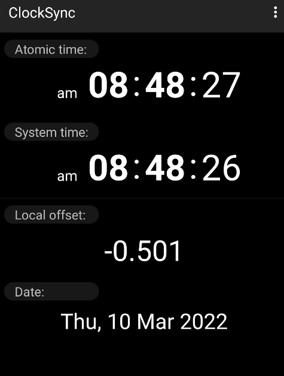
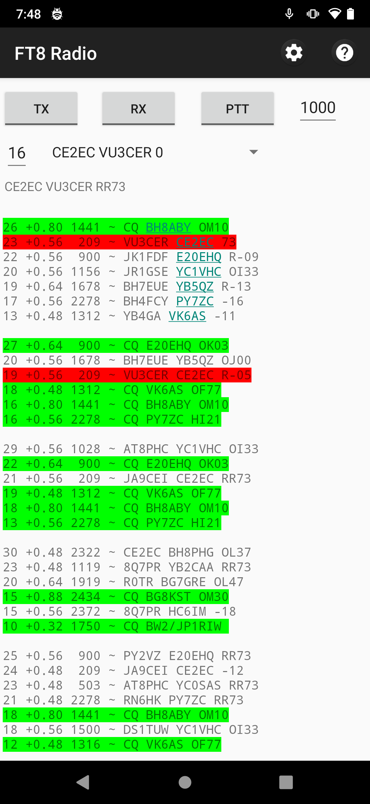

### FT8 Decoder

This is the support repository for the `Digital Radio Receiver` / `FT8 Decoder`
app. [Here is the link to the `FT8 Decoder` app](https://play.google.com/store/apps/details?id=com.bunzee.digitalradioreceiver).

For the `FT8 Radio` app support, please vist [this URL](https://github.com/kholia/DigitalRadioReceiverSupport/tree/master/NewApp).
[Here is the link to the `FT8 Radio` app](https://play.google.com/store/apps/details?id=com.bunzee.ft8radio).

#### New to FT8?

If you are new to FT8, the following resources could be helpful:

- https://www.essexham.co.uk/ft8-basics-explained

- [Get Started with FT8 - An Introduction for Beginners](https://www.youtube.com/watch?v=YyWX0i87P0o)

- We recommend using the WSJT-X software on a PC (or a Raspberry Pi) first to
  get familiar with FT8.

#### Instructions

- This app currently decodes FT8 traffic by listening to externally provided
  audio - typically from a SSB or SDR receiver.

- Use the ClockSync app (version 1.2.6 by Sergey Baranov) to verify the time on
  your Android phone. Getting the time correct on your phone is CRITICAL!
  Without correct time on your phone, the app will NOT be able to decode FT8
  traffic.

  To correct the time on your phone WITHOUT root access, copy the `Local
  offset` value from the ClockSync app into the `Time Delta` field in the app
  settings (keeping the negative sign as it is, if present).

  This new `Time Delta (Internal Clock)` feature smartly avoids various
  time-syncing-issues on Android.

  Example:

  The `ClockSync` app shows `-0.501` as the `Local offset`.

  

  So enter the same exact `-0.501` value in the `Time Delta` field in the app
  settings.

- Support is [available over email](mailto:dhiru.kholia@gmail.com?subject=[GitHub]%20FT8%20Decoder%20Support)
  and at https://github.com/kholia/DigitalRadioReceiverSupport.

- Change the `Callsign` and the `Grid` values in app settings. Enable
  `spotting` in app settings for added fun. The `spotting` feature is currently
  in the works.

  It does NOT compute (WSJT-X) SNR presently, and it reports back `candidate
  scores` instead.

- Attention: The apps needs to keep the display ON to allow the microphone to
  work on modern Android versions. Reduce screen brightness to maximize battery
  life.

- The `incrementing number` you see is the current 'seconds' value - it
  allows debugging the timing setup, and the app.

- Keep the phone next to an audio source (such as HF Rig / Radio / PC).

- Tune your HF Rig / SDR to the correct FT8 frequency.

  See https://www.sigidwiki.com/wiki/FT8#Frequencies for a list of FT8 frequencies.

  ATTENTION: Please ensure that you can hear the FT8 "tunes" by ear.

- The primary focus of this app is on `decodes per watt` in the field (portable
  operations).

- Keep the radio / rig volume at a comfortable level. The app is known to work
  even when the phone is kept across the room from the radio / rig!

#### Known Issues

- The app launcher icon is missing on Android 6.x (at least).

- The app will auto-restart when needed - this is not ideal but better than the
  alternate options.

- The app is NOT CrashFree (yet). We are working on improving this.

#### Planned Features

- [LP] Highlight a chosen callsign (alerting for a particular callsign)

- [LP] Dark theme

- [LP] Waterfall display (spectrum)

- [LP] Volume meter

Thanks to `Perrin Trease` for many of these ideas - 73!

#### Tips

Listening to FT8 tunes all day might not be fun for everyone. Use the following
cable to connect the sound-output of your radio to an Android phone.

This sound card is connected to the following `USB OTG Hub (Type-C)`.

Note: You may also use a `single port` OTG adapter or OTG cable instead of
this `USB OTG Hub (Type-C)`.

This cable was built, and tested on 15th-December-2021.

Tip: Use the `Audio Amplitude` tool from the `Phyphox` app to measure the
microphone sound levels.

You may also find `ground loop isolators` useful.

#### Testing Notes

The app is regularly tested on the following phones:

- Redmi Note 8 Pro running Android 11

- Redmi Note 7 Pro running Android 12

- Redmi Note 7 running Android 10

- Nexus 5 (`hammerhead`) running LineageOS 7.1.2

#### Tested Radios

- XHDATA D-808 radio (in-built telescopic antenna, TECSUN AN-05 Antenna, DIY Spool Wire Antenna)

- ICOM IC-7300 (20m dipole)

  - Audio-over-the-air mode is supported as usual

  - IC-7300 can also be directly connected to phone's OTG port using a USB
    cable

  - I can recommend the `Tripp Lite USB 2.0 Hi-Speed A/B Cable with Ferrite
    Chokes (M/M) 3-ft. (U023-003)` cable for IC-7300.

- ICOM IC-705 (20m dipole, https://github.com/kholia/HF-Balcony-Antenna-System)

  - Audio-over-the-air mode is supported as usual

  - IC-705 can also be directly connected to phone's OTG port using a Micro USB
    cable

- uBITX (20m dipole, Quick-RX-Antenna -> random wire folded in a small loop)

  ATTENTION: Use https://github.com/kholia/Light-Intuitive-Digital-Interface
  for uBITX instead of the (simpler) audio-connection-cable from this repository.

- uSDX V1.02

  - Audio-over-the-air mode is supported as usual

  - A standard 3.5mm AUX cable can be used to connect uSDX to a USB sound card
    connected to an Android phone.

- Yaesu FT-991A (via a customer report)

#### Currently untested

- Interoperability with `SDR Touch`

#### App's Performance

The app is able to decode FT8 signals from 100+ countries in a single day with
a modest 'untuned' 20m terrace dipole antenna installed at ~70 feet AGL.

#### Privacy Policy

This application is related to amateur radio communication.

You may choose to enable the optional `spotting` feature, which will upload
your FT8 spots to the third-party https://pskreporter.info/ site.

https://pskreporter.info/ is a well-known and widely accepted site among the
amateur radio community for `spotting` purposes.

The 'spots transfer protocol' is described at [this URL](https://pskreporter.info/pskdev.html).

In short, the `FT8 spots` are sent over UDP to port `4739` to `report.pskreporter.info` site.

#### Related / References

- https://github.com/kholia/Easy-Digital-Beacons-v1 (sending FT8 easily)
- https://github.com/kholia/libusb/
- https://github.com/kholia/airspyhf/ (wouldn't this be neat?)
- https://www.sigidwiki.com/wiki/FT8#Frequencies
- https://github.com/Guenael/rtlsdr-ft8d
- https://physics.princeton.edu/pulsar/k1jt/wsjtx.html
- [Phyphox App](https://play.google.com/store/apps/details?id=de.rwth_aachen.phyphox)
- [ClockSync App](https://www.apkmirror.com/apk/sergey-baranov/clocksync-2/)
- https://ve3nea.github.io/MorseExpert/ (super informative)

#### Credits

- https://github.com/kgoba/ft8_lib (MIT License)

  License URL: https://github.com/kgoba/ft8_lib/blob/master/LICENSE

  I am an upstream contributor to this repository.

- https://github.com/drowe67/freedv-gui/blob/master/src/pskreporter.cpp

  License URL: https://github.com/drowe67/freedv-gui/blob/master/COPYING (GNU Lesser General Public License v2.1)

- https://www.joda.org/joda-time/ - https://www.joda.org/joda-time/licenses.html

- https://github.com/mik3y/usb-serial-for-android

  - https://github.com/mik3y/usb-serial-for-android/blob/master/LICENSE.txt

#### Note For Friends

Would you like to test a new and different `TX capable FT8 app`?

[Here is the link to the new `FT8 Radio` app](https://play.google.com/store/apps/details?id=com.bunzee.ft8radio).

This is me making a 16000 kilometers DX QSO from my Android phone connected
directly to IC-7300.

NOTE: See [this help file](./NewApp/README.md) for this new `FT8 Radio` app.

Are you interested in joining a like-minded community of home brewers? Here is the [Telegram group join link for 'HAMBREWERS'](https://t.me/hambrewers).
